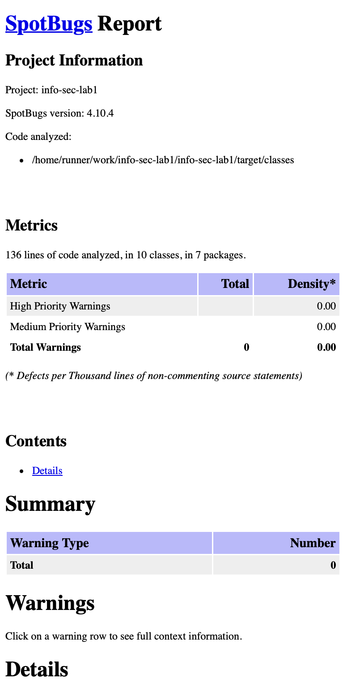
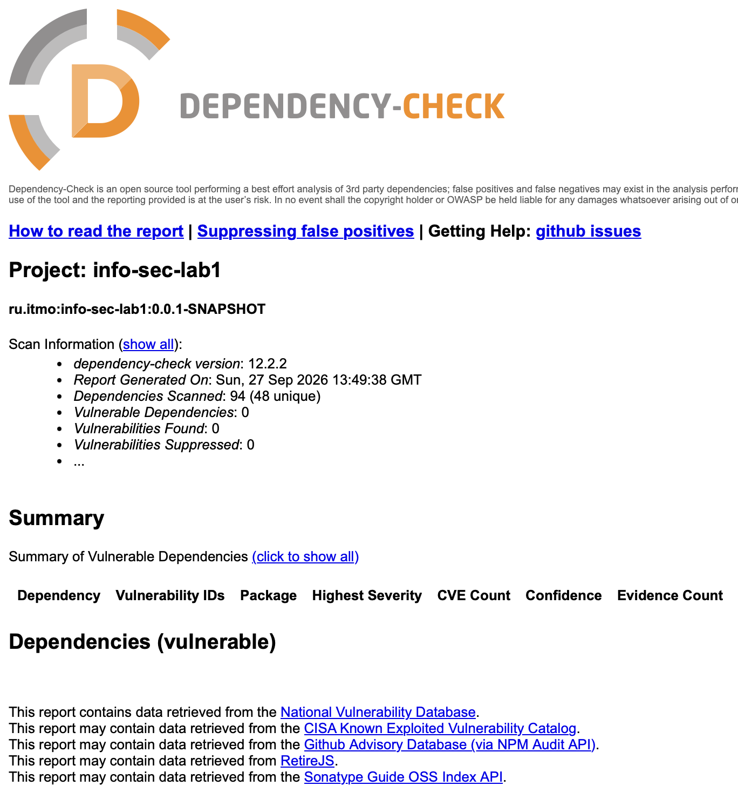

# Работа 1. Разработка защищенного REST API с интеграцией в CI/CD

## Павличенко Софья P3415

Приложение на Java 21, Spring Boot, Maven и PostgreSQL. Пользователь может зарегистрироваться, войти и получить список пользователей после аутентификации.

## API

`POST /auth/register` - регистрация пользователя:

```sh
curl -X POST http://localhost:8080/auth/register \
  -H 'Content-Type: application/json' \
  -d '{"username":"student","password":"password123"}'
```

`POST /auth/login` - вход. Ответ содержит JWT в поле `token`:

```sh
curl -X POST http://localhost:8080/auth/login \
  -H 'Content-Type: application/json' \
  -d '{"username":"student","password":"password123"}'
```

`GET /api/data` - список пользователей. Требует JWT из ответа на вход:

```sh
curl http://localhost:8080/api/data \
  -H 'Authorization: Bearer <JWT>'
```

Без токена `GET /api/data` возвращает HTTP 401.

## Меры защиты

- **SQLi:** работа с PostgreSQL идёт через Spring Data JPA/Hibernate. Пользовательские значения передаются как параметры запросов; SQL из строк ввода не собирается.
- **XSS:** имя пользователя ограничено буквами, цифрами и `_`. При формировании ответов регистрации и списка `UserResponse.from` экранирует его через `HtmlUtils.htmlEscape`. Пароль и его хэш в ответах не возвращаются.
- **Аутентификация:** пароли хранятся в виде BCrypt-хэшей. При входе пароль сравнивается с хэшем, после чего выдаётся подписанный JWT сроком на один час. Spring Security проверяет подпись и срок действия токена перед доступом к `/api/data`.

## Отчёты

### SpotBugs



### OWASP Dependency-Check


